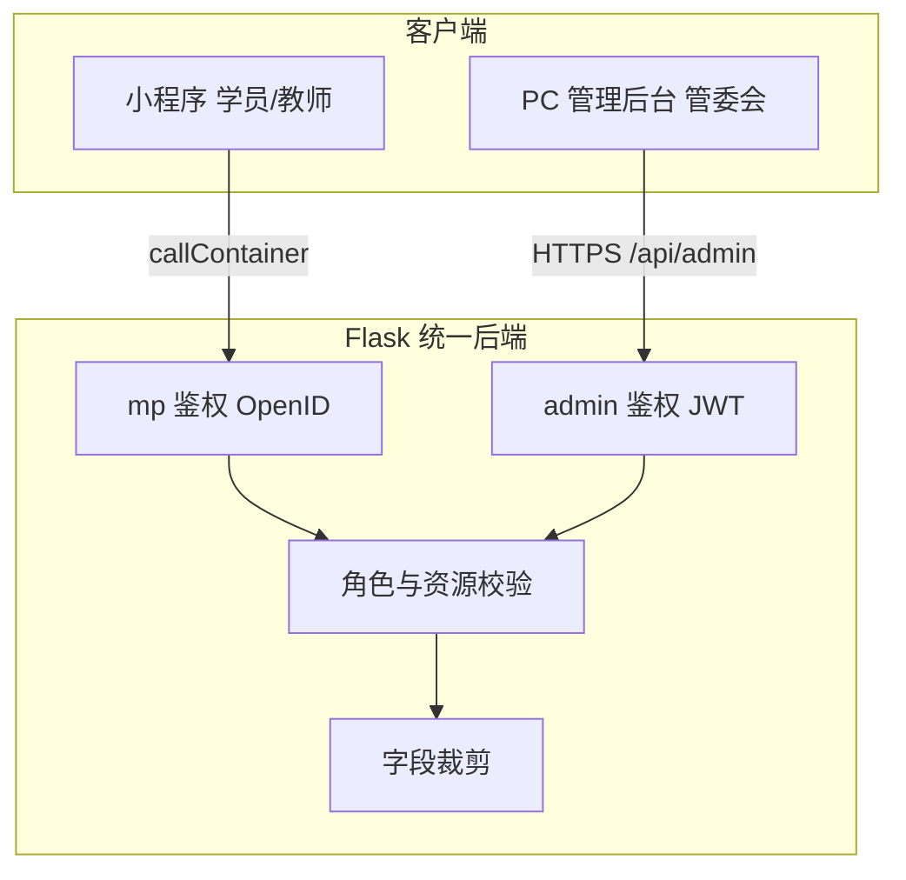

# 喜乐瑜伽教师管理小程序 — 技术选型报告

> **版本**：v1.4  
> **更新日期**：2026年6月13日  
> **状态**：✅ 开发基线，产品范围与 UI 原型初步定稿后锁定  
> **参考模板**：[技术选型最终交付报告_20260604_194752.md](技术选型最终交付报告_20260604_194752.md)  
> **需求依据**：[需求调研-喜乐瑜伽教师管理小程序.md](需求调研-喜乐瑜伽教师管理小程序.md)（宏观版 V2.1）  
> **更新说明**：v1.4 补充瑜伽工作室模块，首期收敛为 **管委会年审 + 教师本人查询 + 学员查教师 + 工作室基础展示与维护**；月度教学记录、资讯/课程、工作室预约支付后置。


## 执行摘要

本项目为 **喜乐瑜伽教师资质管理与查询** 的微信小程序系统。首期 MVP 聚焦：**管委会年审管理、教师查看本人资质与年审情况、学员查教师资质、瑜伽工作室基础展示与维护**；月度教学记录、资讯/课程、工作室预约支付、有赞深度集成等能力后期上线。

经评估，**延续已验证的统一部署技术路线**，在降低运维成本的前提下满足业务需求：

| 模块 | 选型 | 核心决策理由 |
|------|------|-------------|
| 小程序端 | 微信原生框架 + Wot UI | **学员查询 + 教师自服务**，移动场景体验好 |
| **PC 管理后台** | **Vue 3 + Element Plus** | **管委会主工作台**：看板、表格、Excel 导入、批量审批 |
| 后端 | Flask + 微信云托管 | 一套 API 同时服务小程序与管理端 |
| 数据库 | 腾讯云 TDSQL-C (Serverless) | MySQL 兼容，适合教师台账、年审记录等关系型数据 |
| 对象存储 | 云托管 / COS | 年审附件、导入文件 |
| 外部链接 | 小程序 `web-view` / `navigator` | 有赞学堂首期外链 |
| 部署方式 | **统一镜像（Nginx + Flask 共存）** | `/admin` 静态站 + `/api` 共用，与参考项目一致 |
| AI 辅助开发 | Cursor + 既有工具链 | 延续团队习惯，加速 CRUD 与联调 |

**关键结论**：

- **双端分工**：小程序面向 **学员 / 教师**；**管委会**以 **PC 管理后台** 为主（手机屏小、表格多、导入导出频繁，PC 效率更高）。
- 小程序通过 **`wx.cloud.callContainer`** 访问后端；管理端通过 **云托管公网域名 `/admin` + `/api`**，同源无跨域问题。
- 管理后台首期即纳入 MVP，与参考项目技术路线对齐，**不延后**。
- **0.5核 + 1GB** 足够支撑 MVP（教师人数待 Excel 确认，日活 &lt;500）；管理端为静态资源，几乎不增加 CPU 压力。
- 云托管 **最小实例数 = 1**；复杂「分级授权」、订阅消息、有赞 SSO 仍放二期。
- 首期采用“**后台维护基础信息，前台按权限查询展示**”的产品口径，降低教师端表单复杂度。


## 1. 选型决策依据

### 1.1 业务特征（驱动选型）

| 特征 | 技术影响 |
|------|----------|
| 三类角色、权限差异大 | 后端 RBAC；小程序（学员/教师）+ 管理端（管委会）分端展示 |
| 管委会重表格/导入操作 | **PC 管理后台**承担看板、审批、Excel 导入导出 |
| 教师五档分级 + 年审状态机 | 关系型数据库 + 可配置年审周期：L0-L3 两年、L4 三年、L5 免审 |
| 学员侧以「查 + 搜」为主，弱登录 | 学员接口可匿名或仅 OpenID，敏感字段脱敏 |
| 教师本人查询、年审材料 | 结构化表 + 对象存储存附件 |
| 历史 Excel 台账导入 | 后端解析 openpyxl + 管委会一次性导入任务 |
| 有赞学堂 | 外链跳转，首期不引入电商 SDK |

### 1.2 核心原则（与参考项目一致）

- **开发效率优先**：Python Flask 快速迭代，AI 友好。
- **运维成本最小化**：云托管 + Serverless 数据库，不买 ECS。
- **部署极简化**：Nginx + Flask 单容器，减少服务数量。
- **端侧职责清晰**：管委会走 PC，学员/教师走小程序；MVP 不引入消息订阅、支付等扩展依赖。

### 1.3 被排除的替代方案

| 替代方案 | 排除原因 |
|----------|----------|
| uni-app / Taro | 本项目无跨端诉求，原生小程序更简单、包体更可控 |
| Spring Boot | 团队 Python 栈更高效，业务以 CRUD + 审批流为主 |
| 微信云开发（纯云函数） | 年审、权限、导入等逻辑偏复杂，不适合碎片化云函数 |
| 自建 ECS + Nginx | 运维与安全成本高，与「免运维」目标冲突 |
| 管委会全部用小程序 | 看板、宽表、Excel 导入在手机上体验差；**PC 管理端首期纳入** |
| 有赞/微盟 SaaS 替代自研 | 无法满足教师分级、管委会审批、定制字段与权限模型 |


## 2. 最终技术栈详解

### 2.1 小程序端

| 项 | 选型 | 说明 |
|----|------|------|
| 框架 | **微信原生** | 学员主包 + 教师分包；**不含管委会重功能** |
| UI | **Wot UI** | 表单、搜索、列表、标签、空状态等 |
| 状态 | 页面级 `data` + 少量全局 `app.globalData` | MVP 不引入重型状态库 |
| 网络 | `utils/request.js` 封装 `wx.cloud.callContainer` | 统一 loading / 错误 / 冷启动重试 |
| 外链 | `web-view` 或复制链接 | 有赞凤凰世纪学堂 |
| 登录 | `wx.login` + OpenID | 学员弱登录；教师白名单绑定 |

**小程序页面规划（首期）**：

```
pages/
├── index/              # 学员首页：搜索入口
├── teacher-search/     # 教师列表与筛选
├── teacher-detail/     # 教师概要信息
├── studios/            # 瑜伽工作室列表
├── studio-detail/      # 工作室详情
└── packageTeacher/     # 教师分包
    ├── home/
    ├── profile/        # 本人详细信息
    └── review-apply/   # 年审申请
```

管委会 **不在小程序实现** 看板/审批/导入；可在「关于」页提供管理后台链接（可选）。

> **关键约束**：小程序 API 走 `callContainer`；管委会写操作仅开放给管理端登录态。

### 2.2 后端服务

| 项 | 选型 | 说明 |
|----|------|------|
| 语言/框架 | **Python 3.10 + Flask** | 蓝图划分：`auth` / `teacher` / `review` / `studio` / `content` |
| WSGI | **Gunicorn + gevent** | 1 worker，适配 0.5 核 |
| ORM | **SQLAlchemy 2.x** 或 **Flask-SQLAlchemy** | 模型：用户、教师、档位、年审 |
| 校验 | **Pydantic** 或 marshmallow | 请求体与导入数据校验 |
| 任务 | 首期同步处理 | Excel 导入若耗时可改后台线程/二期 Celery |
| 文件 | 云托管对象存储 API | 年审附件上传、下载鉴权 |

**核心领域模块**：

| 模块 | 职责 |
|------|------|
| `auth` | 小程序 OpenID 登录；管理端 JWT 登录（`admin_users`） |
| `teacher` | 教师 CRUD、概要/详情、搜索筛选 |
| `tier` | 五档分级配置（可配置表，避免写死） |
| `annual_review` | 年审申请、审批、有效期计算 |
| `studio` | 瑜伽工作室列表、详情、后台维护 |
| `admin_stats` | 管委会看板聚合统计 |
| `import` | Excel 历史数据导入（管委会） |
| `content` | 资讯/课程列表（二期） |

### 2.3 数据库（TDSQL-C Serverless）

**选型理由**：教师、年审、审批记录均为强关系数据；需要事务（审批通过同时更新有效期）。

**首期核心表（逻辑模型）**：

| 表 | 用途 |
|----|------|
| `users` | 小程序用户：OpenID、`role`（student/teacher）、`teacher_id` |
| `admin_users` | 管委会账号：用户名、密码哈希、状态、权限 scope |
| `teachers` | 概要字段、档位、有效期、状态 |
| `teacher_details` | 详细信息、管委会备注 |
| `teacher_tiers` | 档位字典（名称以 Excel 为准，含年审周期配置） |
| `annual_reviews` | 年审申请单、材料、审批结果 |
| `studios` | 工作室名称、城市、地址、主理教师、展示状态、封面图 |
| `import_batches` | 导入任务日志 |

**索引建议**：`teachers.xile_name`、`teachers.real_name`、`teachers.city`、`teachers.tier_id`、`annual_reviews.status + due_year`。

**缓存（可选）**：Redis Serverless 缓存看板统计（5 分钟 TTL），非首期必须。

### 2.4 PC 管理后台（管委会 · 首期纳入）

| 项 | 选型 | 说明 |
|----|------|------|
| 框架 | Vue 3 + Vite + Element Plus | 与参考项目一致 |
| 使用者 | **教师管理委员会** | 日常审核、维护台账的主入口 |
| 首期功能 | 看板统计、教师检索、详情/备注、年审审批、工作室维护、Excel 导入 | 宽表、筛选、导出 |
| 登录 | 账号 + 密码（或手机号验证码）→ JWT | 与小程序 OpenID 登录分离 |
| 部署 | `admin-src` 构建 → `backend/admin-dist`，Nginx `/admin` | 与 Flask 同容器 |

**为何管委会用 PC 而非小程序**：

| 场景 | 手机小程序 | PC 管理后台 |
|------|------------|-------------|
| 多列教师台账浏览 | 差 | 好（Element Table） |
| Excel 批量导入 | 几乎不可行 | 原生支持拖拽上传 |
| 年审待办批量处理 | 操作繁琐 | 列表勾选、批量通过/驳回 |
| 看板数字一览 | 可用但信息密度低 | 图表 + 多维筛选 |
| 管委会备注录入 | 长文本不便 | 大屏编辑舒适 |

**管理端首期页面（示意）**：

```
/admin
├── login
├── dashboard          # 各档人数、年审四维统计
├── teachers           # 列表、搜索、详情抽屉
├── reviews            # 年审待办、审批
├── studios            # 工作室列表、编辑、展示状态
├── import             # Excel 导入、预检报告
└── settings           # 账号、档位配置（可选）
```

### 2.5 统一部署架构（与参考项目一致）

```
┌─────────────────────────────────────────┐
│           微信云托管（单容器）            │
│  ┌─────────────────────────────────────┐│
│  │            Nginx (80)                ││
│  │  /admin  → Vue 管理端静态（管委会）    ││
│  │  /api    → Flask (5000)              ││
│  └─────────────────────────────────────┘│
│  ┌─────────────────────────────────────┐│
│  │   Gunicorn + Flask (127.0.0.1:5000) ││
│  └─────────────────────────────────────┘│
└─────────────────────────────────────────┘
         │
         ▼
   TDSQL-C (Serverless)
   对象存储（附件）
```

### 2.6 AI 辅助工具链

| 工具 | 本项目用途 |
|------|------------|
| Cursor | 主力：API、小程序页面、SQL、联调 |
| 飞书 CLI | 需求文档、调研材料同步 |
| Stitch（可选） | 小程序 UI 稿 |
| CodeBuddy（可选） | 微信开发者工具内生成页面 |

**推荐流程**：

```
需求确认 → 数据模型/API → 管理端 + 小程序并行开发 → 统一镜像部署
```


## 3. 访问方式与集成

### 3.1 小程序 → 后端（推荐）

```javascript
// miniprogram/utils/request.js
const SERVICE = 'xile-yoga-service'; // 云托管服务名

export async function request({ url, method = 'GET', data }) {
  const res = await wx.cloud.callContainer({
    path: `/api${url}`,
    method,
    data,
    header: { 'X-WX-SERVICE': SERVICE }
  });
  return res.data;
}
```

- 无需 ICP 备案域名配置在小程序后台 request 列表（私有协议）。
- 后端从云托管上下文获取 **OpenID**，用于识别学员/教师身份。

### 3.2 管理后台 → 后端

管理端浏览器访问云托管公网域名，与 API **同源**：

| 访问 | 地址示例 |
|------|----------|
| 管理端首页 | `https://xxx.run.tcloudbase.com/admin` |
| 登录 API | `POST /api/admin/auth/login` |
| 业务 API | `GET/POST /api/admin/*`（请求头带 `Authorization: Bearer <JWT>`） |

```javascript
// admin-src/utils/request.js
import axios from 'axios';

const client = axios.create({ baseURL: '/api' });
client.interceptors.request.use(cfg => {
  const token = localStorage.getItem('admin_token');
  if (token) cfg.headers.Authorization = `Bearer ${token}`;
  return cfg;
});
```

- 管理端 **不走** `callContainer`，走标准 HTTPS。
- 使用云托管**默认公网域名**即可，无需单独备案（与参考项目一致）。
- 管委会账号存在 `admin_users` 表，与小程序 `users`（OpenID）可关联同一自然人，但**登录态独立**。

### 3.3 有赞凤凰世纪学堂（首期）

| 方案 | 选型 | 说明 |
|------|------|------|
| 外链 H5 | ✅ 首期 | `web-view` 打开有赞链接，或引导复制链接 |
| 账号 SSO | 📋 二期 | 需有赞开放能力与客户授权，暂不纳入 |

### 3.4 微信能力清单（按阶段）

| 能力 | 首期 | 二期 |
|------|------|------|
| `wx.login` / OpenID | ✅ | |
| `callContainer` | ✅ | |
| 订阅消息（年审提醒） | | ✅ |
| 手机号快速验证 | 视甲方是否要求 | |
| 云存储上传（年审材料） | ✅ | |


## 4. 性能与规格规划

### 4.1 业务量级假设（待甲方确认）

| 指标 | MVP 假设 | 说明 |
|------|----------|------|
| 在册教师 | 50～300 | 影响导入与搜索 |
| 日活用户 | &lt;500 | 学员查询为主 |
| 管委会并发 | &lt;10 | 审批非高频 |
| 附件存储 | &lt;10GB | 年审材料 |

### 4.2 云托管推荐配置

| 阶段 | CPU / 内存 | 适用场景 |
|------|------------|----------|
| **MVP（推荐）** | **0.5核 + 1GB** | 日活 &lt;500，教师规模待 Excel 确认 |
| 成长期 | 1核 + 2GB | 日活 500～2000 或导入任务变重 |
| 扩容 | 水平扩展 2～3 实例 | CPU 持续 &gt;70% |

**Gunicorn 配置**（与参考项目一致）：

```python
# backend/gunicorn.conf.py
workers = 1
worker_class = 'gevent'
bind = '127.0.0.1:5000'
timeout = 30
```

### 4.3 监控阈值

| 指标 | 警戒值 | 动作 |
|------|--------|------|
| API P95 延迟 | &gt;800ms | 查 SQL / 加索引 / 升配 |
| CPU | 持续 &gt;70% | 扩容或升配 |
| 导入失败率 | &gt;5% | 检查 Excel 模板与校验日志 |
| 冷启动 102002 | 频繁 | 确认最小实例=1 |


## 5. 安全与权限设计（双端架构）

**小程序**（学员 / 教师）与 **PC 管理后台**（管委会）共用一套 Flask API，但 **登录方式与入口分离**。权限以后端为准，前端菜单隐藏不能代替校验。

### 5.1 双端分工与鉴权方式

| 端 | 使用者 | 登录方式 | API 前缀 | 身份识别 |
|----|--------|----------|----------|----------|
| 微信小程序 | 学员、教师 | `wx.login` → OpenID | `/api/mp/*` | 云托管上下文 OpenID → `users` |
| PC 管理后台 | 管委会 | 账号密码 / 手机验证码 → JWT | `/api/admin/*` | `Authorization: Bearer` → `admin_users` |



### 5.2 设计原则

| 原则 | 说明 |
|------|------|
| 后端权威 | 管委会写操作 **仅** `/api/admin/*`；小程序无审批/导入/备注接口 |
| API 分域 | `mp` 与 `admin` 蓝图隔离，避免误暴露管理接口 |
| 字段裁剪 | 学员仅概要 DTO；教师本人详情 DTO；管委会全量 DTO |
| 双表账户 | `users`（OpenID）与 `admin_users`（管委会）分离，降低混权风险 |
| 分期扩展 | 「按档授权」二期叠加 `admin_users.scopes` |

### 5.3 小程序侧（学员 / 教师）

**登录**：`wx.login` → `GET /api/mp/auth/me` → 返回 `role: student | teacher`。

| 角色 | 成为方式 |
|------|----------|
| 学员 | 默认 OpenID 即可，弱登录 |
| 教师 | 管委会在后台预置白名单，或邀请码绑定 `teacher_id` |

**页面入口**：学员走主包；教师在「我的」进入 `packageTeacher`。**不包含管委会管理页**。

```javascript
const profile = await request({ url: '/mp/auth/me' });
const home = profile.role === 'teacher'
  ? '/packageTeacher/home/index'
  : '/pages/index/index';
```

### 5.4 管理后台侧（管委会）

**登录**：`POST /api/admin/auth/login` → JWT → 存 `localStorage`。

**路由守卫**（Vue Router）：

```javascript
router.beforeEach((to, from, next) => {
  if (to.meta.requiresAuth && !localStorage.getItem('admin_token')) {
    next('/login');
  } else next();
});
```

管委会账号由超级管理员在后台创建，**不支持小程序自助注册**。

### 5.5 接口权限矩阵（首期）

**小程序 API `/api/mp/*`**：

| 接口 | student | teacher |
|------|---------|---------|
| `GET /teachers/search` | ✅ 概要 | ✅ 概要 |
| `GET /teachers/:id/summary` | ✅ | ✅ |
| `GET /studios` | ✅ | ✅ |
| `GET /studios/:id` | ✅ | ✅ |
| `GET /teachers/:id/detail` | ❌ | ✅ 仅本人 |
| `POST /annual-reviews` | ❌ | ✅ 仅本人 |

**管理端 API `/api/admin/*`**（均需 JWT + `admin` 角色）：

| 接口 | 说明 |
|------|------|
| `GET /stats/dashboard` | 各档人数、年审四维统计 |
| `GET /teachers` | 分页列表、多维筛选 |
| `GET /teachers/:id` | 全量详情 + 备注 |
| `PUT /teachers/:id/remark` | 写管委会备注 |
| `GET /reviews` | 年审待办列表 |
| `PUT /reviews/:id/approve` | 审批通过/驳回 |
| `GET /studios` | 工作室列表 |
| `POST /studios` / `PUT /studios/:id` | 新增/编辑工作室 |
| `POST /import/teachers` | Excel 导入 |
| `GET /import/:id/report` | 导入预检报告 |

**Flask 鉴权示意**：

```python
# 小程序
@mp_bp.get('/teachers/<int:tid>/detail')
@require_mp_roles('teacher')
def mp_detail(tid, current_user):
    if current_user.teacher_id != tid:
        abort(403)

# 管理端
@admin_bp.put('/reviews/<int:rid>/approve')
@require_admin_jwt
def approve(rid, admin_user):
    ...
```

### 5.6 数据可见性（DTO）

| DTO | 使用端 | 内容 |
|-----|--------|------|
| `TeacherSummaryDTO` | 小程序 · 学员/教师查他人 | 概要字段，无备注 |
| `TeacherSelfDetailDTO` | 小程序 · 教师本人 | 本人基础信息、资质有效期、年审状态 |
| `TeacherAdminDetailDTO` | 管理后台 | 全字段 + 备注 + 年审材料 |

### 5.7 与「按档分级授权」的关系

```text
基础层：admin_users 具备 admin 角色即可访问 /api/admin/*
扩展层（二期）：admin_users.scopes = { tier_ids: [1,2] }
```

首期管委会账号默认可见全部档位。

### 5.8 其它安全项

| 项 | 方案 |
|----|------|
| 管理端密码 | bcrypt 存储；登录失败限流 |
| JWT | 有效期 8h；支持刷新或重新登录 |
| 附件 | 私有存储；管理端/教师本人可下载 |
| 审计 | 审批、备注、导入操作写 `audit_logs`（含 `admin_user_id`） |
| 防刷 | 学员搜索按 OpenID 限流 |

### 5.9 落地清单

1. 设计 `users`、`admin_users` 表及绑定流程  
2. 实现 `/api/mp/auth/me`、教师邀请码绑定  
3. 实现 `/api/admin/auth/login`、JWT 中间件  
4. 拆分 `mp` / `admin` 蓝图，管委会写接口仅挂在 `admin`  
5. 三套 DTO + 审计日志  
6. Vue 管理端：登录、路由守卫、看板/审批/工作室/导入页  
7. 小程序：学员 + 教师分包 + 工作室展示（无管委会分包）  

---

## 6. 项目结构（Monorepo）

```
xile-yoga/
├── miniprogram/                 # 微信小程序（学员 + 教师）
│   ├── pages/                   # 学员主包
│   ├── packageTeacher/          # 教师分包
│   ├── components/
│   └── utils/request.js
├── admin-src/                   # Vue 3 管理后台源码（管委会）
│   ├── src/views/               # dashboard / teachers / reviews / import
│   └── src/utils/request.js
├── backend/
│   ├── app/
│   │   ├── api/
│   │   │   ├── mp/              # 小程序 API 蓝图
│   │   │   └── admin/           # 管理端 API 蓝图
│   │   ├── models/
│   │   ├── services/
│   │   └── utils/
│   ├── migrations/
│   ├── admin-dist/              # Vue 构建产物（npm run build）
│   ├── nginx.conf
│   ├── Dockerfile
│   ├── gunicorn.conf.py
│   ├── requirements.txt
│   └── start.sh
├── docss/                       # 需求、选型文档
├── scripts/
│   └── feishu_upload.py
├── project.config.json
└── README.md
```

**`project.config.json` 打包忽略**（与参考项目一致）：

```json
{
  "miniprogramRoot": "miniprogram/",
  "packOptions": {
    "ignore": [
      { "type": "folder", "value": "backend" },
      { "type": "folder", "value": "admin-src" },
      { "type": "folder", "value": "docss" },
      { "type": "folder", "value": "scripts" }
    ]
  }
}
```


## 7. 部署与成本估算

### 7.1 部署清单

| 组件 | 平台 | 说明 |
|------|------|------|
| 小程序 | 微信公众平台 | 提交审核、发布 |
| 后端+静态 | 微信云托管 | 单服务，端口 80 |
| 数据库 | TDSQL-C Serverless | 与云托管同地域（建议深圳） |
| 对象存储 | 云托管内置或 COS | 年审附件 |
| 域名 | 云托管默认域名 | 管理端 `https://xxx.run.tcloudbase.com/admin` |

### 7.2 成本粗算（与参考项目同量级）

| 资源 | 月费估算 |
|------|----------|
| 云托管 0.5核1GB（min=1） | ¥35～60 |
| TDSQL-C Serverless | ¥10～30 |
| 对象存储 + 流量 | ¥5～20 |
| **合计** | **¥50～110** |

> 教师规模、附件量、是否启用 Redis 会影响实际账单。

### 7.3 环境划分

| 环境 | 用途 |
|------|------|
| dev | 开发者本地 + 云托管体验版 |
| staging | 甲方 UAT，独立数据库实例 |
| prod | 正式上线 |


## 8. 分期实施与里程碑

与 [需求调研宏观版](需求调研-喜乐瑜伽教师管理小程序.md) 三阶段对齐：

### 8.1 第一期 MVP（约 8～10 个工作日）

| 序号 | 工作项 | 产出 |
|------|--------|------|
| 1 | 环境：云托管 + 数据库 + 统一镜像骨架 | 可联调环境 |
| 2 | 数据模型 + Excel 导入模板 | 表结构 + `admin_users` + 样例 Excel |
| 3 | 后端 API：`/api/mp` + `/api/admin` 鉴权 | 双端登录可用 |
| 4 | **管理后台**：登录、看板、教师列表、年审审批、工作室维护、导入 | 管委会主流程可跑通 |
| 5 | 小程序 · 学员：搜索 + 教师概要 + 工作室列表/详情 | 可验资质有效性，可查看认证工作室 |
| 6 | 小程序 · 教师：本人信息 + 年审申请 | 基础自服务 |
| 7 | 统一镜像构建（Nginx + admin-dist + Flask） | Docker 本地验证 |
| 8 | 部署上线 + 最小实例配置 | 生产可用 |

### 8.2 第二期（需求确认后）

- 订阅消息（年审到期提醒）
- 教师月度教学记录
- 资讯 / 课程 CMS
- 工作室预约 / 报名 / 支付
- 复杂分级授权（按档 scope）
- 有赞深度集成（若需要）
- 管理端高级报表、批量导出优化

### 8.3 依赖甲方输入（阻塞项）

| 输入 | 影响 |
|------|------|
| 五档教师附表 Excel | 导入脚本与字段映射 |
| Excel 档位名称与编码映射 | 状态机与有效期算法 |
| 小程序主体与管理员 | 上线与支付/消息资质 |
| 有赞链接 | 外链配置 |


## 9. 风险与应对

| 风险 | 影响 | 应对 |
|------|------|------|
| Excel 档位映射或特殊规则未确认 | 返工审批流 | 档位/周期做成配置表；默认按 L0-L3 两年、L4 三年、L5 免审 |
| 历史数据质量差 | 导入失败 | 提供模板 + 预检报告 + 人工核对流程 |
| 管理端与小程序权限混淆 | 误暴露审批接口 | API 分域 `mp`/`admin`；管委会写操作仅 admin 蓝图 |
| 喜乐名/重名搜索 | 查询歧义 | 双字段索引 + 结果列表展示档位与城市 |
| 学员弱登录被滥用 | 接口刷量 | 频率限制 + 仅开放概要字段 |
| 冷启动 | 首屏慢 | min实例=1 + 客户端重试 |
| 附件含隐私 | 合规风险 | 私有存储 + 权限校验 + 保留周期策略 |
| 需求蔓延（支付/报名） | 工期失控 | 严格对照 MVP 清单，二期立项 |


## 10. 附录

### 10.1 技术栈版本建议

| 依赖 | 版本 |
|------|------|
| Python | 3.10+ |
| Flask | 3.x |
| Gunicorn | 21+ |
| gevent | 24+ |
| SQLAlchemy | 2.x |
| 微信基础库 | ≥ 2.25.0（callContainer） |
| Wot UI | 稳定版，随小程序基础库兼容性锁定 |
| Vue | 3.x |
| Element Plus | 稳定版，随 Vue 3 版本锁定 |

### 10.2 本地 Docker 验证

```bash
docker build -t xile-yoga:latest -f backend/Dockerfile .
docker run -p 8080:80 -e MYSQL_ADDRESS=xxx xile-yoga:latest
# API:     http://localhost:8080/api/health
# 管理端:  http://localhost:8080/admin
```

### 10.3 与参考报告差异对照

| 项 | 参考项目（通用） | 本项目 |
|----|------------------|--------|
| 用户入口 | 小程序 + 管理端 | **小程序（学员/教师）+ PC 管理端（管委会）**，双端首期 |
| 核心业务 | 通用 CRUD | **年审工作流 + 教师分级 + 公开查询** |
| 外部系统 | — | **有赞外链（首期）** |
| 消息 | — | **订阅消息二期** |
| 部署架构 | 统一镜像 | **相同** |
| 规格 | 0.5核1GB 起步 | **相同**，量级相当 |

### 10.4 审批记录

| 角色 | 姓名 | 意见 | 日期 |
|------|------|------|------|
| 技术负责人 | [待填] | | |
| 产品/甲方 | [待填] | 需求范围确认后锁定 | |

---

**本报告在需求宏观版确认后升级为 Final 版，并作为开发与估算的唯一技术基线。**
